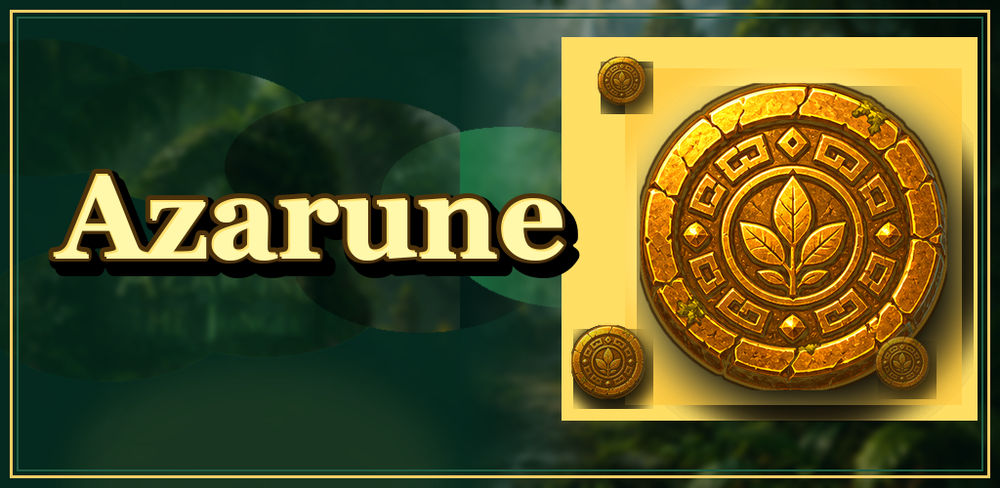
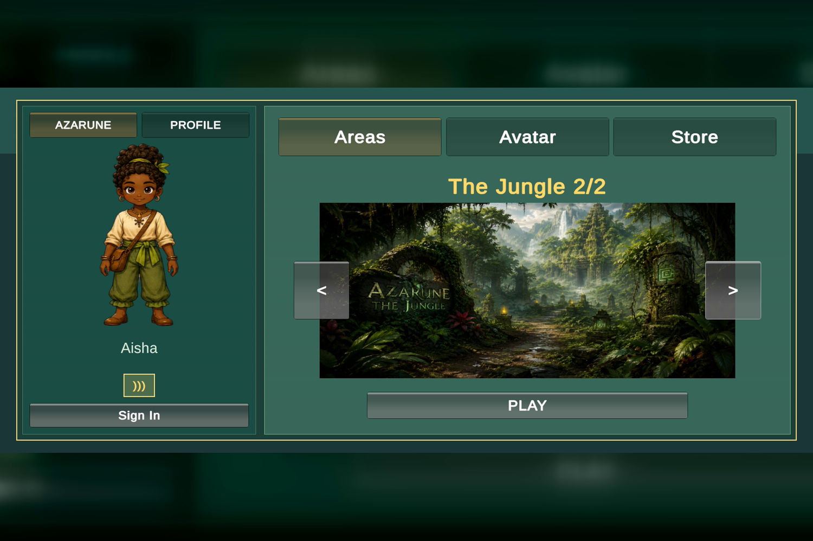
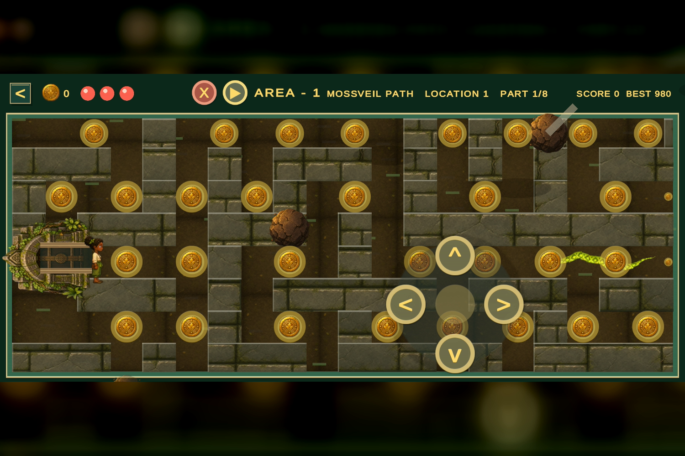
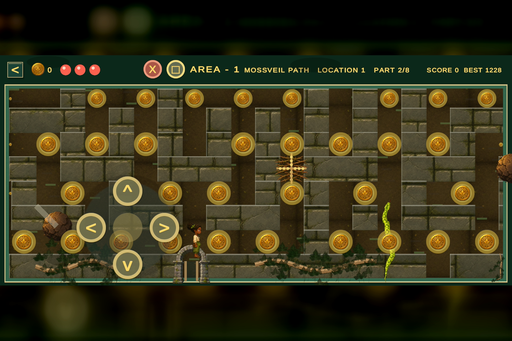
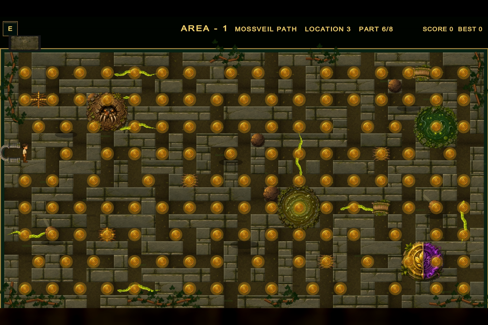

# Azarune

  

**Azarune is a fantasy adventure for Android that introduces players to the jungle world of Azarune through a guided trial.** Players explore, collect Soul Gems, pursue an ancient relic, survive environmental hazards, and progress toward the portal.

## Play experience

- Portal-to-Azarune introductory trial with welcome and tutorial flow.
- Soul Gem collection and Ancient Spell/relic objectives.
- Player profile and Azarian avatar selection.
- Jungle regions, named locations, hidden temples, and maze exploration.
- Creatures, falling rocks, sinking-swamp hazards, traps, treasure, score, health, and progression systems.
- Multi-scene journey spanning login, onboarding, dashboard, jungle, and Deep Forest Maze experiences.

## Gameplay visuals

| Enter the jungle | Jungle gameplay |
|---|---|
|  |  |

| Traps and Soul Gems | Mossveil maze |
|---|---|
|  |  |

## Demo

[Download the narrated gameplay demo](assets/azarune-demo.mp4)

## Technology

Unity 6000.2.14f1, C#, Universal Render Pipeline, Unity Input System, Android, and IL2CPP.

## Development status

Azarune is in closed testing. This showcase documents the current playable experience while the proprietary source and production project remain private.

## Portfolio notice

This repository contains presentation material only—no proprietary game source. A guided build or code walkthrough can be provided on request.
